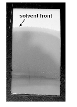

# Experiment 1: stikstofbasesynthese in een model prebiotische reactie

In dit experiment gebruik je stoffen die waarschijnlijk beschikbaar waren op de vroege aarde en waarmee een stikstofbase van DNA en RNA wordt gemaakt en met dunnelaagchromatografie (TLC) wordt geïdentificeerd. De reactanten die in dit experiment worden gebruikt, zijn formamide, ammoniumformaat en diaminomaleonitril (DAMN). De waarschijnlijke beschikbaarheid van formamide op de vroege aarde wordt ondersteund door de ontdekking van dit molecuul in kometen en andere interstellaire objecten. De andere reactanten - ammoniumformaat en DAMN - kunnen gemakkelijk worden gegenereerd uit formamide of waterstofcyanide ($HCN$).

De onderstaande reactie illustreert hoe $HCN$ kan worden gehydrolyseerd om formamide te vormen, dat verder kan worden gehydrolyseerd tot ammoniumformaat:


DAMN wordt gevormd uit vier HCN-moleculen in geconcentreerde oplossingen van HCN. Er zijn verschillende chemische tussenproducten in dit proces, hoewel het precieze mechanisme momenteel nog onbekend is:


## Tabel: Benodigdheden

|                               | Aantal stuks |
|---------------------------------------------|--------------|
| Formamide                                   | 6 ml         |
| Ammoniumformiaat                            | 1 g          |
| Diaminomaleonitril (DAMN)                   | 0,1 g        |
| Bereide oplossingen van adenine, cytosine en thymine | 1 van elk   |
| Capillaire buis                             | 4            |
| Reageerbuis                                 | 1            |
| 50 ml bekerglas                             | 1            |
| Thermometer                                 | 1            |
| Spatel                                      | 1            |
| Weegschuitje                                | 2            |
| Reageerbuis tang                            | 1            |
| Reageerbuisrek                              | 1            |
| Glazen roerstaaf                            | 1            |
| Maatcilinder van 10 ml of maatpipet         | 1            |
| TLC-plaat                                   | 1            |
| TLC ontwikkelkamer                          | 1            |
| Liniaal                                     | 1            |
| Potlood                                     | 1            |
| Pincet                                      | 1            |

## Procedure

**LEES ALLE INSTRUCTIES VOOR ELKE STAP.**
  

**Stap 1**: Merk een schone reageerbuis met je initialen.

```{image} Plaatjes/Markering_voor_gevaarlijke_stoffen.jpg
:height: 20
:alt: Gevaarlijke stoffen
:align: left
```

*Opmerking: Ammoniumformaat, formamide en DAMN zijn irriterend voor de huid en ogen. Draag handschoenen en wees voorzichtig bij het werken met deze chemicaliën. Als een van deze chemicaliën in contact komt met je huid, was de plek onmiddellijk met zeep en water.*

**Stap 2**: Weeg met een van de weegschuitjes 1,0 g ammoniumformaat en doe dit in je reageerbuis.  
**Stap 3**: Meet met een maatcilinder 6,0 ml formamide af en voeg deze toe aan de reageerbuis die het ammoniumformaat bevat.  
**Stap 4**: Roer de oplossing met een roerstaaf en observeer. Noteer je waarneming.  
**Stap 5**: Dek je reageerbuis goed af en plaats deze gedurende 5 minuten in het zandbad (of de oven). Noteer de tijd en wanneer je je monster moet verwijderen.  
**Stap 6**: Ga door naar stap 6 terwijl je monster zich in het zandbad bevindt. Weeg met je andere weegschuitje exact 0,1 g diaminomaleonitril (DAMN) af voor gebruik in stap 8.  
**Stap 7**: Verwijder na 5 minuten met behulp van de reageerbuistang het monster uit het zandbad en plaats het in een reageerbuisrek. Als alle vaste ammoniumformaat is opgelost ga dan naar stap 8. Als er vast materiaal in de reageerbuis achterblijft, plaats je de buis nogmaals in het zandbad (3 minuten) voordat je verdergaat met stap 8.  
**Stap 8**: Zodra de reageerbuis koel aanvoelt voeg je voorzichtig de DAMN die in stap 6 is afgewogen toe aan de reageerbuis. Meng grondig met een roerstaafje.  
**Stap 9**: Plaats een stop op de reageerbuis en keer met je duim op de stop de reageerbuis meerdere keren om zodat alle DAMN van de zijkanten loskomt.  
**Stap 10**: Plaats de reageerbuis 20 minuten terug in het zandbad of de oven. Noteer het tijdstip van invoer en bereken en noteer wanneer je de buis moet verwijderen. Terwijl je reageerbuis in het zand staat bereid je de TLC-plaat en kamer voor. Je hebt ruimte nodig voor vier plekken op je plaat - het reactiemonster en de stockoplossingen van adenine, cytosine en thymine.  

**Stap 11**: Verwijder na 20 minuten met een reageerbuistang het monster uit het zand of oven en plaats het in een reageerbuisrek om af te koelen.  
**Stap 12**: Wanneer de reageerbuis koel aanvoelt, breng je het afgedekte mengsel naar de zuurkast. Meet hier 1 mL van het reactiemengsel af in een spuit of maatcilinder en voeg toe in een klein bekerglas. Gooi het resterende reactiemengsel in de daarvoor bestemde afvalbak in de zuurkast.  
**Stap 13**: Neem het monster mee terug naar je werkplek. Voeg 10 ml water toe aan het bekerglas met reactiemengsel en roer.  

**Stap 14**: Spot de TLC-plaat:  
1. Gebruik capillaire buizen om adenine, cytosine, thymine en het reactiemengsel aan te brengen. Gebruik voor elk monster een aparte buis.  
2. Doop de capillaire buis gelabeld 'A' in de adenine-oplossing en breng een klein vlekje aan bij het corresponderende streepje op de plaat.  
3. Herhaal dit voor cytosine (C), thymine (T) en het reactiemengsel (R).  
4. Laat de stippen drogen en bekijk eventueel onder een UV-lamp. Markeer zichtbare stippen met potlood.  

**Stap 15**: Ontwikkel de TLC-plaat:  
1. Controleer of het vloeistofniveau in de ontwikkelkamer onder de oorsprongslijn ligt.  
2. Plaats de TLC-plaat voorzichtig in de kamer tegen de wand zonder filtreerpapier.  
3. Dek de kamer af met folie of een horlogeglas.  
4. Verwijder de plaat zodra het front 1 cm van de bovenkant is.  
5. Markeer het oplosmiddelfront met potlood.  

 

**Stap 16**: Droog de TLC-plaat en visualiseer de vlekken met UV-licht. Markeer de contouren voorzichtig met potlood.  
**Stap 17**: Bereken de Rf-waarden:  
$R_f$ = afstand verplaatst door molecuul / afstand oplosmiddelfront vanaf startlijn.  
Voorbeeld: $R_f$ = 5,5 cm / 6,0 cm = 0,92