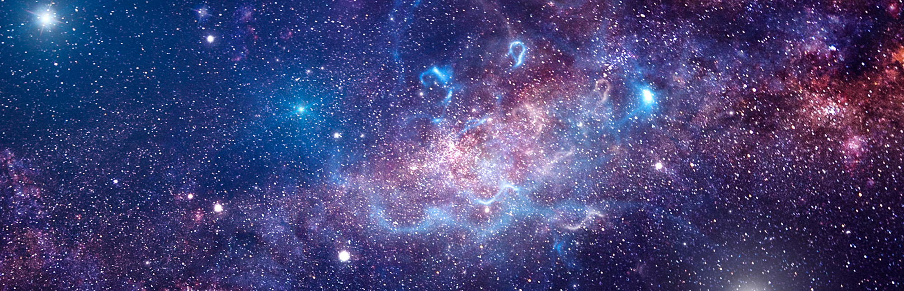

# **NLT module Astrobiologie**

Deze module is ontwikkeld door Coen Klein Douwel, Docent NLT en scheikunde in samenwerking met Garmt de Vries (Universiteit Utrecht) en Arnoud van Zoest.

Bekijk de inhoudsopgave maar eens....
